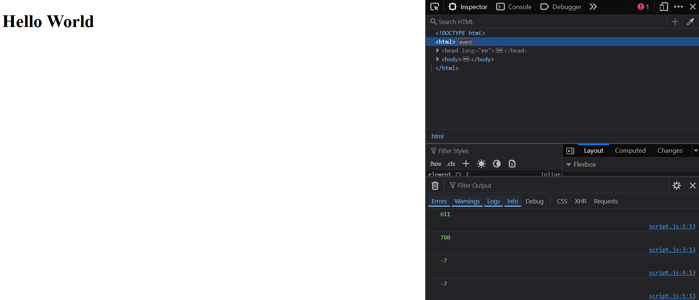

# BOM_Browser-Object-Model
 
 - Browser Object Model - Control browser and read browser information

In browser runtime environments, the so-called **BOM (Browser Object Model)** is available in addition to the **DOM (Document Object Model)**. Using this object model, it is possible to control certain aspects of the browser (e.g. going back and forth in the browser history) and to read out certain information from the browser (e.g. information on the size and position of the current browser window).

## The Browser Object Model
The entry point for the browser object model is the global `window` object. This object represents a single browser window. This object represents a single browser window. This global object is also the entry point into the **DOM**, which is represented by the `document` object. The `document` object is actually a property of the `window` object, so it is possible to write both `document` and `window.document`.

The following objects in particular play a role in the BOM API:
 - The general properties of the `window` object to access window information.
 - The `location` property contains information on the current URL of the browser window.
 - The `history` property contains a reference to an object of the `History` type, which can be used to access and change the browser history.
 - The `navigation` property contains a reference to an object of the type `Navigator`, this object provides various general information about the browser.
 - The `screen` property contains a reference to an object of the `Screen` type, which can be used to determine various information about the screen.


## Access window information
### Determine the size and position of a browser window
There is a whole range of properties for determining the size and position of a browser window:

| Property            | Description  |
| ------------------- | ------------ | 
| `innerHeight` | Contains the height of the window content including the horizontal scrollbar. |
| `innerWidth` | Contains the width of the window content including the vertical scrollbar.|
| `outerHeight` | Contains the height of the browser window including all browser bars. |
| `outerWidth` | Contains the width of the browser window including all browser bars. |
| `screenX` | Contains the position of the browser window on the x-axis, i.e. the distance of the browser window to the left edge of the screen.  |
| `screenY` | Contains the position of the browser window on the y-axis, i.e. the distance of the browser window to the top of the screen. |
| `scrollX` | Contains the number of pixels that the web page has already been scrolled horizontally. |
| `scrollY` | Contains the number of pixels that the web page has already been scrolled vertically. |
| `pageXOffset` | An alias for `window.scrollX` |
| `pageYOffset` | An alias for `window.scrollY` |

Example:
   
 [Complete code - Part_1 - click here](https://github.com/BellaMrx/BOM_Browser-Object-Model/tree/main/BOM/Part_1)

  ```
    console.log(window.innerHeight);        // 611
    console.log(window.innerWidth);         // 780
    console.log(window.screenX);            // -7
    console.log(window.screenY);            // -7
  ```

  